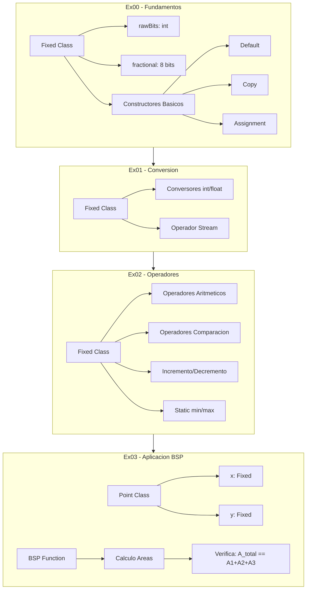

# CPP Module 02 - Fixed-Point Arithmetic & Operator Overloading


![C++]README.md creado exitosamente con:

- Badges de C++98, 42 School, OOP y Memory Management
- Descripcion clara del proyecto de punto fijo
- Features basados en el codigo real (ex00-ex03)
- Stack tecnologico extraido del Makefile
- Decisiones tecnicas explicando porque punto fijo vs flotante
- Diagrama Mermaid mostrando la progresion de ejercicios
- Guia de instalacion con comandos Make
- Links de contacto GitHub yLinkedIn
na clase de numeros de punto fijo (`Fixed`) con sobrecarga completa de operadores, culminando en un algoritmo de **Binary Space Partitioning (BSP)** para detectar si un punto reside dentro de un triangulo.

## Features

- Clase `Fixed` con representacion de punto fijo (8 bits fraccionales)
- **Canonical Orthodox Form** completo (Constructor, Copy Constructor, Assignment Operator, Destructor)
- Sobrecarga de operadores aritmeticos (`+`, `-`, `*`, `/`)
- Sobrecarga de operadores de comparacion (`>`, `<`, `>=`, `<=`, `==`, `!=`)
- Sobrecarga de operadores de incremento/decremento (`++`, `--`)
- Funciones estaticas `min()` y `max()` sobrecargadas
- Operador de insercion de flujo (`<<`) para output
- Algoritmo BSP para determinar pertenencia de punto a triangulo

## Stack Tecnologico

| Componente | Descripcion |
|------------|-------------|
| Lenguaje | C++ (std=c++98) |
| Compilador | c++ (clang++) |
| Standard | C++98 |
| Flags | `-Wall -Werror -Wextra -g` |

## Arquitectura y Decisiones Tecnicas

Se opto por una representacion de **punto fijo** en lugar de flotante por dos razones fundamentales:

1. **Determinismo**: Los numeros de punto fijo garantizan resultados reproducibles entre plataformas, critico en sistemas embebidos y simulaciones.
2. **Rendimiento**: Operaciones aritmeticas en enteros son significativamente mas rapidas que en punto flotante en hardware sin FPU.

La arquitectura sigue el patron **Canonical Orthodox Form** exigido por 42 School, asegurando gestion correcta de recursos con el patron Rule of Three (Constructor de copia, Operador de asignacion, Destructor).

El ejercicio `ex03` aplica estos fundamentos para resolver un problema geometrico real: verificar si un punto esta dentro de un triangulo mediante el calculo de areas parciales.

## Diagrama de Arquitectura



## Guia de Instalacion

### Prerrequisitos

- Compilador C++ compatible con C++98 (clang++, g++)
- Make

### Compilacion y Ejecucion

```bash
# Ejercicio 00 - Fundamentos
cd ex00 && make && ./program

# Ejercicio 01 - Conversion
cd ex01 && make && ./program

# Ejercicio 02 - Operadores
cd ex02 && make && ./program

# Ejercicio 03 - BSP
cd ex03 && make && ./program
```

### Limpieza

```bash
make fclean  # Limpia objetos y ejecutable
make re      # Recompila desde cero
```

## Estructura del Proyecto

```
.
ex00/
  |-- src/
  |   |-- Fixed/Fixed.{hpp,cpp}
  |   |-- main.cpp
  |-- Makefile
ex01/
  |-- src/
  |   |-- Fixed/Fixed.{hpp,cpp}
  |   |-- main.cpp
  |-- Makefile
ex02/
  |-- src/
  |   |-- Fixed/Fixed.{hpp,cpp}
  |   |-- main.cpp
  |-- Makefile
ex03/
  |-- src/
  |   |-- Fixed/Fixed.{hpp,cpp}
  |   |-- Point/Point.{hpp,cpp}
  |   |-- bsp.cpp
  |   |-- main.cpp
  |-- Makefile
```

## Aprendizajes Clave

- Orthodox Canonical Form y su importancia en la gestion de recursos
- Diferencia entre shallow copy y deep copy
- Sobrecarga de operadores miembros vs no miembros
- Operadores de pre-incremento vs post-incremento
- Funciones miembro const-correctness
- Static member functions

## Contacto

[](https://github.com/samuelhm/)
[](https://www.linkedin.com/in/shurtado-m/)