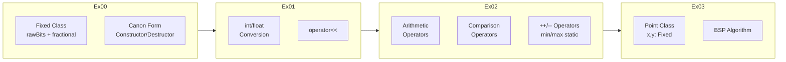

# CPP Module 02 - Fixed-Point Arithmetic & Operator Overloading


## Descripcion

Implementacion completa de una clase de numeros en punto fijo (`Fixed`) con 8 bits fraccionales, siguiendo el **Orthodox Canonical Form**. El proyecto culmina aplicando estos conceptos en un algoritmo **BSP (Binary Space Partitioning)** para determinar si un punto pertenece al interior de un triangulo.

## Caracteristicas Principales

- Clase `Fixed` con representacion de punto fijo (8 bits fraccionales)
- Canon Orthodox Form completo (Default constructor, Copy constructor, Assignment operator, Destructor)
- Conversiones entre tipos: `int` <-> `Fixed` <-> `float`
- Sobrecarga de operadores aritmeticos: `+`, `-`, `*`, `/`
- Sobrecarga de operadores de comparacion: `>`, `<`, `>=`, `<=`, `==`, `!=`
- Operadores de incremento/decremento: pre-incremento (`++a`) y post-incremento (`a++`)
- Funciones estaticas `min()` y `max()` sobrecargadas (const y non-const)
- Algoritmo geometrico BSP para deteccion de punto en triangulo

## Stack Tecnologico

| Componente | Tecnologia |
|------------|------------|
| Lenguaje | C++ (std=c++98) |
| Compilador | clang++ / g++ |
| Build System | Make |
| Flags | `-Wall -Werror -Wextra -g` |

## Decisiones Tecnicas y Arquitectura

Se opta por **punto fijo** sobre punto flotante por razones fundamentales:

**Determinismo**: Los numeros de punto fijo producen resultados reproducibles entre plataformas, critico en simulaciones, sistemas embebidos y Finanzas cuantitativas donde la precision decimal exacta es mandate.

**Rendimiento**: Las operaciones con enteros son intrinsecamente mas rapidas que con punto flotante, especialmente en arquitecturas sin FPU dedicada.

La arquitectura sigue el **Orthodox Canonical Form** exigido por 42 School, implementando el "Rule of Three": constructor por copia, operador de asignacion y destructor para gestion correcta de recursos.

El ejercicio final (`ex03`) demuestra la aplicacion practica: utilizar aritmetica de punto fijo para calcular areas parciales y determinar inclusion de punto en triangulo mediante la formula del determinante.

## Diagrama de Arquitectura



## Instalacion y Ejecucion

### Prerrequisitos

- Compilador C++ (clang++ o g++)
- Make

### Compilacion

```bash
# Ex00 - Orthodox Canonical Form
cd ex00 && make && ./program

# Ex01 - Conversores y Stream
cd ex01 && make && ./program

# Ex02 - Operadores Sobrecargados
cd ex02 && make && ./program

# Ex03 - BSP Point-in-Triangle
cd ex03 && make && ./program
```

### Limpieza

```bash
make fclean    # Elimina objetos y ejecutable
make re        # Recompila desde cero
```

## Estructura del Proyecto

```
CPP-MODULE-02/
├── ex00/
│   ├── src/
│   │   ├── Fixed/Fixed.hpp
│   │   ├── Fixed/Fixed.cpp
│   │   └── main.cpp
│   └── Makefile
├── ex01/
│   ├── src/
│   │   ├── Fixed/Fixed.hpp
│   │   ├── Fixed/Fixed.cpp
│   │   └── main.cpp
│   └── Makefile
├── ex02/
│   ├── src/
│   │   ├── Fixed/Fixed.hpp
│   │   ├── Fixed/Fixed.cpp
│   │   └── main.cpp
│   └── Makefile
├── ex03/
│   ├── src/
│   │   ├── Fixed/Fixed.hpp
│   │   ├── Fixed/Fixed.cpp
│   │   ├── Point/Point.hpp
│   │   ├── Point/Point.cpp
│   │   ├── bsp.cpp
│   │   └── main.cpp
│   └── Makefile
```

## Aprendizajes Clave

- Implementacion correcta del Orthodox Canonical Form
- Sobrecarga de operadores miembros vs no miembros (friend functions)
- Diferencia entre pre-incremento (`++a`) y post-incremento (`a++`)
- Const-correctness en funciones miembro
- Static member functions y su uso
- Representacion interna de numeros decimales sin punto flotante
- Aplicacion geometrica: formula del area del triangulo mediante determinantes

## Contacto

[](https://github.com/samuelhm/)
[](https://www.linkedin.com/in/shurtado-m/)